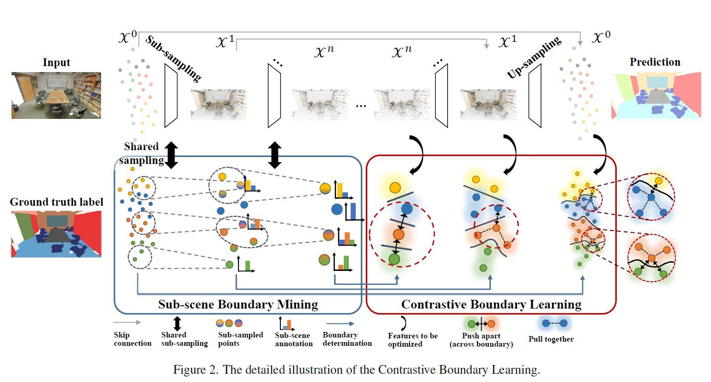
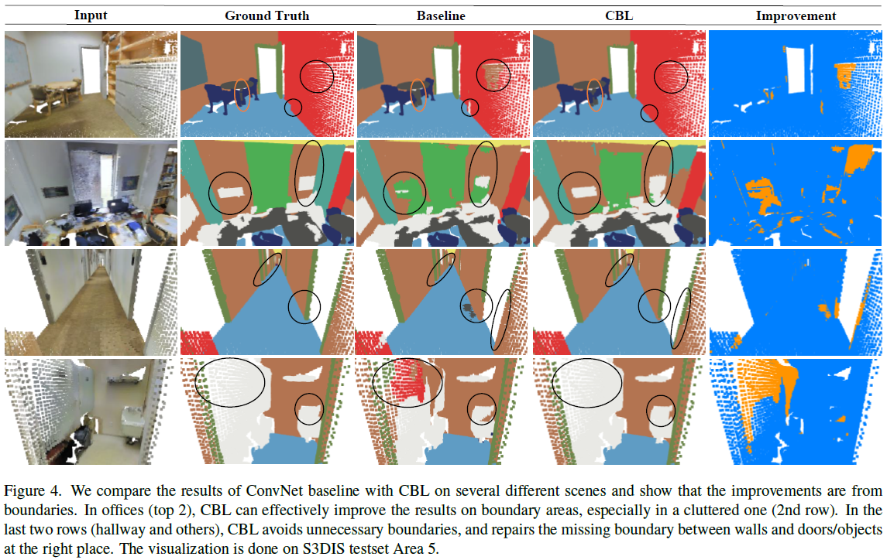

# Contrastive Boundary Learning for Point Cloud Segmentation (CVPR 2022)
By Liyao Tang, Yibing Zhan, Zhe Chen, Baosheng Yu, and Dacheng Tao

This is the implementation of our CVPR 2022 paper: <br>
**Contrastive Boundary Learning for Point Cloud Segmentation** [[arXiv](https://arxiv.org/abs/2203.05272)]



If you find our work useful in your research, please consider citing:

```
@InProceedings{tang2022cbl,
  author={Tang, Liyao and Zhan, Yibing and Chen, Zhe and Yu, Baosheng and Tao, Dacheng},
  booktitle={2022 IEEE/CVF Conference on Computer Vision and Pattern Recognition (CVPR)}, 
  title={Contrastive Boundary Learning for Point Cloud Segmentation}, 
  year={2022},
  volume={},
  number={},
  pages={8479-8489},
  doi={10.1109/CVPR52688.2022.00830}
}
```

## Setup & Usage
For point-transformer baseline, please follow [pytorch/README](https://github.com/LiyaoTang/contrastBoundary/tree/master/pytorch).

For ConvNet and other baselines, please follow [tensorflow/README](https://github.com/LiyaoTang/contrastBoundary/tree/master/tensorflow).

## Pre-trained models
Pretrained models can be accessed [here](https://drive.google.com/drive/folders/1_ppwnrAu6VRqENTPWPt-3KFqCCTtfsFC?usp=sharing), together with training and testing log. Choose the desired baseline and unzip into the corresponding code directory ([tensorflow](https://github.com/LiyaoTang/contrastBoundary/tree/master/tensorflow)/[pytorch](https://github.com/LiyaoTang/contrastBoundary/tree/master/pytorch)) and follow the README there for further instruction.

## Quantitative results


S3DIS (Area 5)
| baseline                | mIoU |  OA  | mACC |
|-------------------------|:----:|:----:|:----:|
| ConvNet + CBL           | 69.4 | 90.6 | 75.2 |
| ConvNet + CBL (kl)      | 69.5 | 90.9 | 75.3 |
| point-transformer + CBL | 71.6 | 91.2 | 77.9 |


## Qualitative results


## Acknowledgement
Codes are built based on a series of previous works, including: <br>
[KPConv](https://github.com/HuguesTHOMAS/KPConv), <br>
[RandLA-Net](https://github.com/QingyongHu/RandLA-Net), <br>
[CloserLook3D](https://github.com/zeliu98/CloserLook3D), <br>
[Point-Transformer](https://github.com/POSTECH-CVLab/point-transformer). <br>
Thanks for their excellent work.


## License
This repo is licensed under the terms of the MIT license (see LICENSE file for details).

